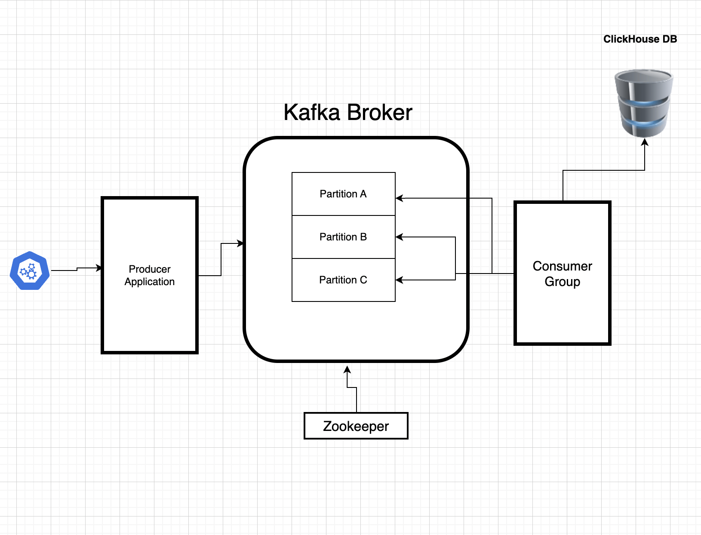

# Kafka Forex Data Streaming pipeline
This project leverages the use of Apache Kafka as a streaming service. It contains a simple producer application (producer.py) that fetches data from a forex api [Polygon.io](https://polygon.io/docs). This then streams data into a Kafka topic where the consumer application (producer.py) feeds on the json data and inerts into a Clickhouse database.

# Architecture

Instructions
1. Create a Clickhouse instance. Help: [Clickouse docs](https://clickhouse.com/docs/en/sql-reference/statements/create/database).
2. Create your database and table 
3. create a docker-compose file for the project and add the contents in the docker-compose.yaml file
4. Spin up the docker-compose.yaml file using docker compose -up
5. Start the producer application using python3 producer.py
6. Start the consumer application using python3 consumer.py