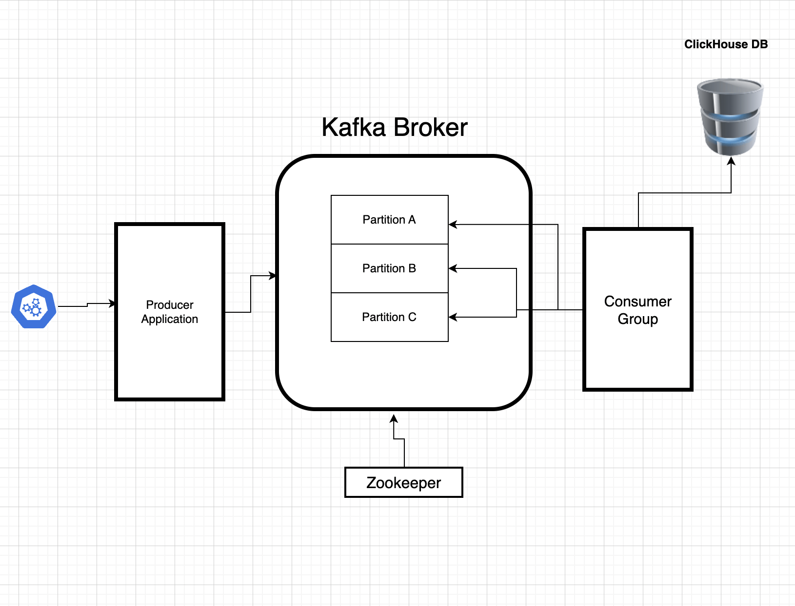

# 📈 Kafka Forex Data Streaming Pipeline

## 🚀 Overview
This project leverages **Apache Kafka** as a real-time streaming service to process Forex market data. The pipeline consists of:
- A **producer application (`producer.py`)** that fetches Forex data from [Polygon.io](https://polygon.io/docs).
- A **Kafka topic** that acts as an intermediary for streaming Forex data.
- A **consumer application (`consumer.py`)** that reads the JSON data from Kafka and inserts it into a **ClickHouse** database.

## 🏗️ Architecture



## ✅ Prerequisites
Before running this project, ensure you have the following installed:
- **Docker & Docker Compose**
- **Python 3.x**
- **Apache Kafka**
- **ClickHouse Database**

## 🛠️ Setup Instructions

### 1️⃣ Create a ClickHouse Instance
Follow the official documentation to set up a ClickHouse instance:
[ClickHouse Docs](https://clickhouse.com/docs/en/sql-reference/statements/create/database)

### 2️⃣ Create Database and Table in ClickHouse
Execute the following SQL commands inside your ClickHouse instance:
```sql
CREATE DATABASE forex;

CREATE TABLE forex.trades (
    timestamp DateTime,
    pair String,
    price Float64,
    volume Float64
) ENGINE = MergeTree()
ORDER BY timestamp;
```

### 3️⃣ Set Up Kafka and ClickHouse Using Docker-Compose
Create a `docker-compose.yaml` file and add the necessary configurations to define Kafka, Zookeeper, and ClickHouse services.

### 4️⃣ Start the Services
Run the following command to spin up Kafka, Zookeeper, and ClickHouse:
```sh
docker compose up -d
```

### 5️⃣ Start the Producer Application
Execute the producer script to start streaming Forex data to Kafka:
```sh
python3 producer.py
```

### 6️⃣ Start the Consumer Application
Execute the consumer script to process and store Forex data in ClickHouse:
```sh
python3 consumer.py
```

## 📌 Notes
- Ensure your Kafka broker is running before starting the producer and consumer.
- Modify the `producer.py` script to use your API key from Polygon.io.
- The `consumer.py` script must be configured with the correct ClickHouse database connection details.

## 📚 Resources
- [Apache Kafka Documentation](https://kafka.apache.org/documentation/)
- [Polygon.io Forex API](https://polygon.io/docs)
- [ClickHouse Documentation](https://clickhouse.com/docs/)

## 📩 Contact
For any inquiries or contributions, feel free to open an issue or reach out!

